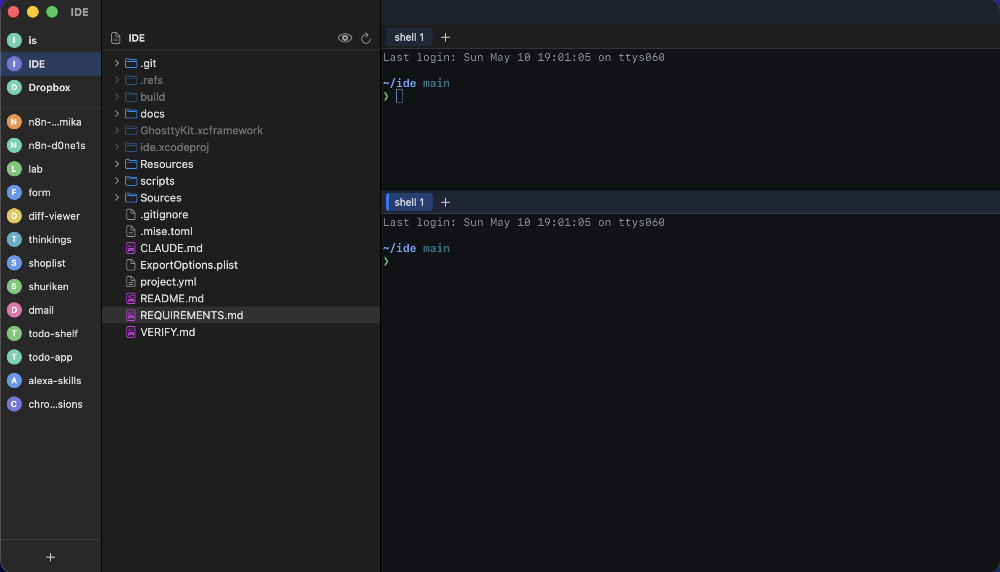

# IDE
macOS 用 IDE。



左から **プロジェクトサイドバー** / **ファイルツリー + プレビュー** / **Ghostty 統合ターミナル**（上下 2 ペイン × 複数タブ）の 3 カラム構成。

主に自分（[@d0ne1s](https://github.com/nyshk97)）が日常で使うために作っているツールです。気になる人は自由に使ったり改造したりして OK ですが、issue / PR は基本的に対応しないので fork 推奨です。

> [!NOTE]
> 配布版（Homebrew）は Apple Developer ID 署名 + notarization 済みです。ソースから自分でビルドする Debug ビルドは ad-hoc 署名です。

---

## 主な機能

- **Ghostty 統合ターミナル** — 上下 2 ペイン × 複数タブ。`~/.config/ghostty/config` をそのまま継承。IME・URL リンク化・AI 種別バッジ（Claude / Codex 検知）・BEL 通知付き
- **プロジェクト管理** — ピン留め永続化 / 一時プロジェクト / `Ctrl+M` で MRU 切替（vim や claude の中でも握る）/ アバター + 色タグ / missing 検知
- **ファイルツリー** — フォルダ先・アルファベット順 / `.gitignore` 薄表示 / git status バッジ（M/A/D/?）
- **ファイルプレビュー** — シンタックスハイライト付きコード（WKWebView + highlight.js）/ Markdown / 画像 / PDF / バイナリ自動判定 / サイズしきい値 / 戻る進む履歴 / `Cmd+Option+O` で Cursor 起動 / `Cmd+J` でツリーとトグル
- **`Cmd+P` クイック検索** — ファジーマッチ + 直近開いたものを優先
- **`Cmd+Shift+F` 全文検索** — `grep` ベース（`ripgrep` 同梱は予定）
- **エラー toast** — 単発エラーと継続的な状態異常を出し分け
- **ログ** — `~/Library/Logs/ide/`（日次ローテーション）

---

## ユーザー向け：Homebrew でインストール

```bash
brew install nyshk97/tap/ide
```

Developer ID 署名 + Apple notarization 済みなので、そのまま起動できます（Gatekeeper の警告は出ません）。

---

## 開発者向け：ソースからビルド

### 必要なもの

- macOS 14+ / Apple Silicon
- Xcode（Swift 6 strict concurrency が通るバージョン）
- [mise](https://mise.jdx.dev/)（XcodeGen を引いてくる）
- **`GhosttyKit.xcframework`** — ghostty fork のビルド成果物（536MB、リポジトリには含まれない）。
  [cmux のリリース](https://github.com/manaflow-ai/cmux/releases) などから取得し、プロジェクトルートに配置してください

### ビルド・起動

```bash
mise run build           # XcodeGen で project 再生成 → Debug ビルド
mise run run             # ビルド + 起動
./scripts/ide-launch.sh  # 既存プロセスを kill して起動だけ
```

Debug ビルドの成果物は `/tmp/ide-build/Build/Products/Debug/IDE.app`。

### Release ビルド（配布用 zip）

```bash
./scripts/build.sh          # build/ide.zip を作る（Developer ID 署名 + notarize。前提は scripts/build.sh の冒頭コメント参照）
./scripts/install.sh        # build/ide.zip を /Applications/IDE.app に展開
./scripts/release.sh 1.0.4  # GitHub Release を作る（gh CLI が必要）
```

### クリーン

```bash
mise run clean   # /tmp/ide-build と ide.xcodeproj を消す
```

---

## ドキュメント

| ファイル | 用途 |
|---|---|
| [REQUIREMENTS.md](./REQUIREMENTS.md) | 要件（仕様の正） |
| [docs/ARCHITECTURE.md](./docs/ARCHITECTURE.md) | モジュール構成・データフロー |
| [docs/DEV.md](./docs/DEV.md) | 開発手順・テスト用環境変数・落とし穴 |
| [VERIFY.md](./VERIFY.md) | 動作確認手順（自動 + 手動） |
| [docs/BACKLOG.md](./docs/BACKLOG.md) | 残タスク・将来アイデア |
| [docs/plans/](./docs/plans) | フェーズ単位の実装計画 |
| [CLAUDE.md](./CLAUDE.md) | Claude Code（AI）向けの作業ガイド |

---

## ライセンス

MIT
