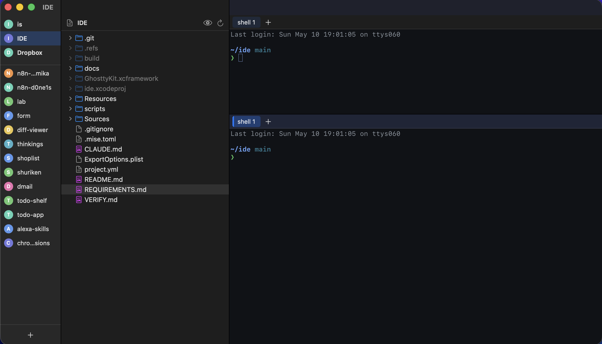

# PolePole

macOS 用の自作 IDE。Ghostty + Claude Code を中心に統合した開発環境。



左から **プロジェクトサイドバー** / **ファイルツリー + プレビュー** / **Ghostty 統合ターミナル**（上下 2 ペイン × 複数タブ）の 3 カラム構成。

---

## ビルド・起動

```bash
mise run build                # XcodeGen で project 再生成 → Debug ビルド
mise run run                  # ビルド + 起動
./scripts/polepole-launch.sh  # 既存プロセスを kill して起動だけ
```

Debug ビルドの成果物は `/tmp/polepole-build/Build/Products/Debug/PolePole Dev.app`。

前提:
- macOS 14+ / Apple Silicon
- Xcode（Swift 6 strict concurrency が通るバージョン）
- [mise](https://mise.jdx.dev/)
- `GhosttyKit.xcframework`（536MB、リポジトリには含まれない）をプロジェクトルートに配置

詳細は [docs/DEV.md](./docs/DEV.md)。

---

## Release 配布

```bash
./scripts/release.sh 1.0.0    # build → notarize → polepole-releases に release を作る
```

事前に `project.yml` の `MARKETING_VERSION` を bump してコミットしておく。配信は `nyshk97/polepole-releases`（Sparkle feed + cask zip）。cask は `nyshk97/homebrew-tap/Casks/polepole.rb` を別途更新する。

---

## ドキュメント

| ファイル | 用途 |
|---|---|
| [CLAUDE.md](./CLAUDE.md) | Claude Code（AI）向けの作業ガイド。最初に読む |
| [REQUIREMENTS.md](./REQUIREMENTS.md) | 要件（仕様の正） |
| [docs/ARCHITECTURE.md](./docs/ARCHITECTURE.md) | モジュール構成・データフロー |
| [docs/DEV.md](./docs/DEV.md) | 開発手順・テスト用環境変数・落とし穴 |
| [VERIFY.md](./VERIFY.md) | 動作確認手順（自動 + 手動） |
| [docs/BACKLOG.md](./docs/BACKLOG.md) | 残タスク・将来アイデア |
| [docs/COMMERCIALIZATION.md](./docs/COMMERCIALIZATION.md) | 商用化に向けた論点 |
| [docs/plans/](./docs/plans) | フェーズ単位の実装計画 |

---

## リポジトリ

- 本体（private）: <https://github.com/nyshk97/ide>
- Sparkle 配信: <https://github.com/nyshk97/polepole-releases>
- Homebrew tap: <https://github.com/nyshk97/homebrew-tap>
- 旧 Sparkle 配信（凍結）: <https://github.com/nyshk97/ide-releases>

リポジトリ名は歴史的事情で `ide` のまま（2026-05-23 にプロジェクト名は `PolePole` にリネーム済み）。
